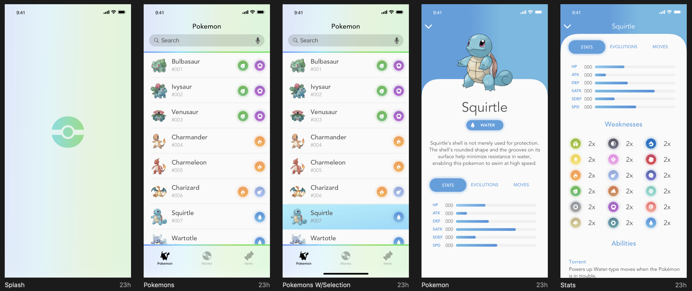

# Pokédex

A ideia desse projeto é ajudar na mentoria de pessoas que tenham o interesse em ingressar na carreira de `front-end`.

A seguir terá um passo a passo de qual caminho deve ser seguido para desenvolver o projeto e cada nível que deve ser alcançado, com isso você pode ter uma ideia do que cada nível deve entregar em uma empresa.

Como o próprio nome diz, o objetivo final é entregar uma pokédex, o layout disso eu vou enviar por zeplin, então por favor [entrem em contato comigo por issue](https://github.com/nathpaiva/pokedex/issues/1) ou [por email, hello@nathpaiva.com](mailto:hello@nathpaiva.com).

Mas para ter uma ideia, essa é uma amostra do layout:

Claro, não fui eu quem criou esse layout, eu peguei ele no [sketch app sources, iOS Pokédex App Sketch Resource
](https://www.sketchappsources.com/free-source/3989-pokedex-app-sketch-freebie-resource.html).

Sim, no ínicio será um layout para mobile, e depois vamos evoluir ele para um layout desktop, ok?

Bom, vamos começar. Depois de pedir o acesso ao [zeplin, lembrem de baixar o aplicativo](https://zeplin.io/), vou criar um link para cada passo que deve ser seguido, começando com:

- [Início](https://github.com/nathpaiva/pokedex/blob/master/INICIO.md)
- [Estágio](https://github.com/nathpaiva/pokedex/blob/master/ESTAGIO.md)
- Júnior
- Pleno
- Senior

Provavelmente vou escrevendo cada estágio de acordo com cada pessoa que vier buscar ajuda na mentoria.

Para tirar dúvidas pode abrir um issue no github, irei responder por lá, e caso você queira ser uma pessoa mentorada por mim, pretendo marcar dias e horários na semana para gente trocar idéia.
